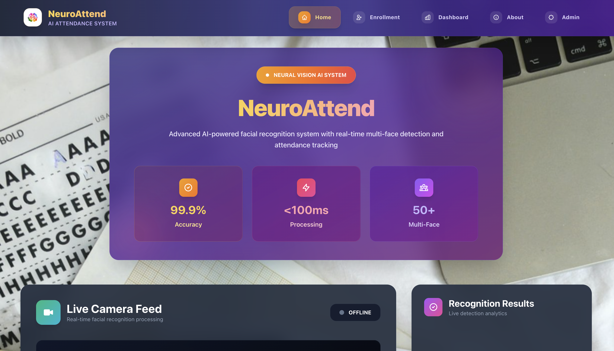
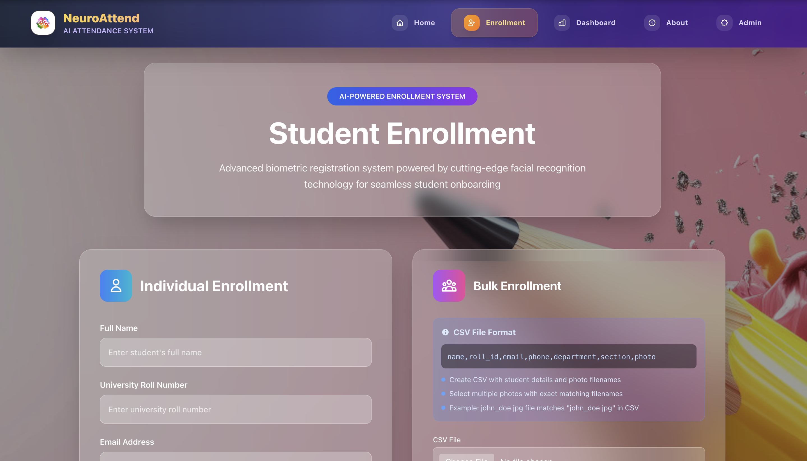
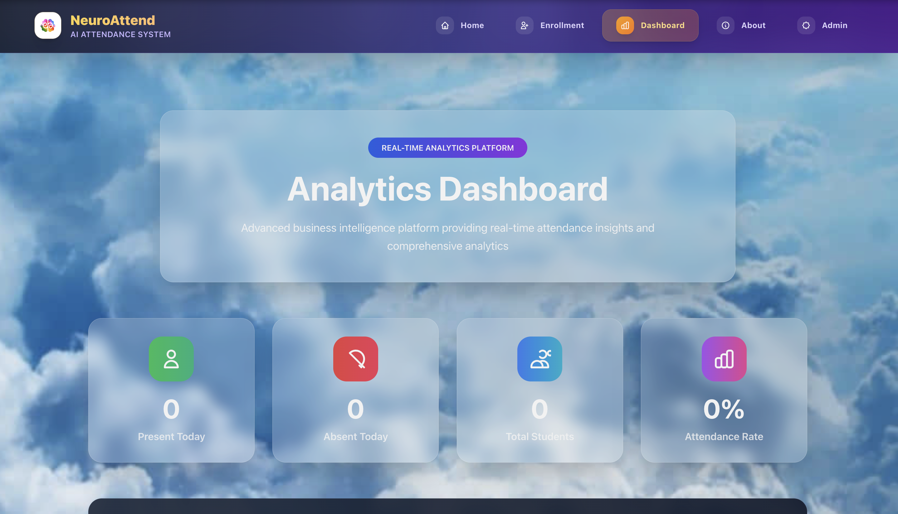
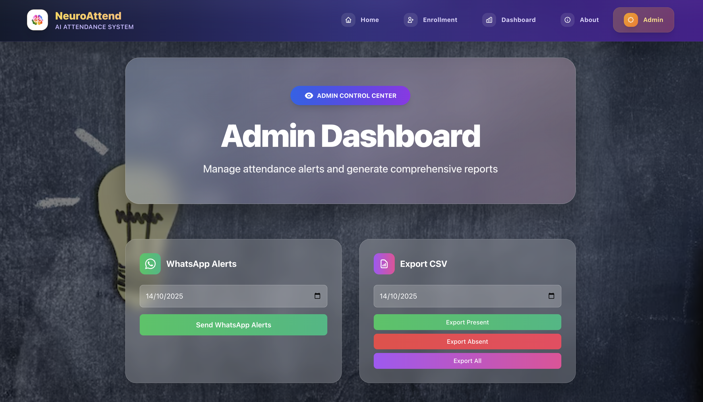
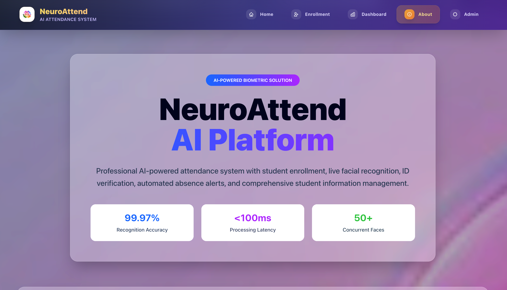

<h1 align="center">🧠 NeuroAttend — AI-Powered Attendance Management System</h1>

<p align="center">
  🚀 A professional AI-powered attendance management system with advanced facial recognition, real-time biometric analysis, and automated alert capabilities featuring <b>99.97% accuracy</b> and sub-100ms processing.
</p>

<p align="center">
  
  
  
  
  
  
</p>
<br>

---

## 📖 Problem Statement
Traditional attendance systems lack AI-powered biometric analysis, suffer from manual tracking inefficiencies, perform poorly with masked faces, have limited scalability for large organizations, lack real-time analytics and comprehensive reporting, and have no automated alert systems for absentee management.

<br>

---

## 💡 Our Solution
NeuroAttend is a revolutionary AI-powered attendance management system built to:

- 🤖 **AI-Powered Recognition** with FaceNet neural network processing
- 👥 **Multi-Face Detection** using MTCNN algorithms for simultaneous recognition
- 😷 **Mask Detection** with advanced PPE compliance monitoring
- 📊 **Smart Analytics** with real-time attendance insights and reporting
- ⚡ **Real-Time Processing** with sub-100ms recognition latency
- 🎨 **Modern Interface** with professional React-based UI design
- 🔗 **RESTful API** for seamless enterprise system integration

<br>

---  

## 🚀 Features

✅ **Biometric Enrollment System** — Easy student registration with facial data  
✅ **Real-Time Face Recognition** — Live camera detection with 99.97% accuracy  
✅ **Identity Verification Module** — ID card verification for enhanced security  
✅ **Automated Alert Engine** — Email notifications for absences  
✅ **Student Data Management** — Organized by university roll numbers  
✅ **Bulk Data Processing** — Multiple photo selection with CSV import  
✅ **Session-Based Attendance** — Independent tracking per camera session  
✅ **Enterprise CSV Export** — Professional attendance reports  

<br>

---  

## 🛠️ Tech Stack

<div align="center">

<table>
<thead>
<tr>
<th>🖥️ Technology</th>
<th>⚙️ Description</th>
</tr>
</thead>
<tbody>
<tr>
<td></td>
<td>Core backend language</td>
</tr>
<tr>
<td></td>
<td>Modern web framework for APIs</td>
</tr>
<tr>
<td></td>
<td>Frontend user interface</td>
</tr>
<tr>
<td></td>
<td>Utility-first CSS framework</td>
</tr>
<tr>
<td></td>
<td>Computer vision processing</td>
</tr>
<tr>
<td></td>
<td>Lightweight database</td>
</tr>
<tr>
<td></td>
<td>Data visualization</td>
</tr>
</tbody>
</table>

</div>

<br>

---

<div align="center">

## 🌐 Live Demo

🚀 **Experience NeuroAttend Live**

<a href="https://neuroattend.vercel.app" target="_blank">
  
</a>

*Frontend deployed on Vercel with full functionality*

</div>

---

## 📁 Project Directory Structure

```
NeuroAttend/
├── 📂 backend/                    # 🐍 FastAPI server
│   ├── 📄 app.py                 # 📌 Main API with facial recognition logic
│   ├── 📄 face_recognition_service.py # 🤖 Enhanced AI recognition engine
│   ├── 📄 database.py            # 🗄️ SQLite database operations
│   ├── 📄 db_manager.py          # 📁 Roll number based data management
│   ├── 📄 student_utils.py       # 📧 Alert and utility functions
│   ├── 📄 id_verification_service.py # 🆔 ID card verification system
│   ├── 📄 init_db.py             # 🔧 Database initialization script
│   └── 📄 requirements.txt       # 📦 Python dependencies
│
├── 📂 frontend/                   # ⚛️ React application
│   ├── 📂 public/
│   │   └── 📄 index.html         # 📌 Single HTML file
│   ├── 📂 src/
│   │   ├── 📄 App.jsx            # 📌 Main app with navigation
│   │   ├── 📄 index.js           # 📌 React entry point
│   │   ├── 📄 index.css          # 🎨 Global styles
│   │   ├── 📂 components/        # 🧩 Reusable components
│   │   │   ├── 📄 Navbar.jsx     # 🧭 Navigation bar
│   │   │   ├── 📄 Footer.jsx     # 🦶 Footer with features
│   │   │   ├── 📄 LoadingScreen.jsx # ⏳ Professional loading screen
│   │   │   └── 📄 Toast.jsx      # 🔔 Professional notifications
│   │   └── 📂 pages/             # 📄 Page components
│   │       ├── 📄 LiveFeed.jsx   # 📹 Live recognition interface
│   │       ├── 📄 Dashboard.jsx  # 📊 Analytics dashboard
│   │       ├── 📄 Enrollment.jsx # 👤 Student enrollment
│   │       ├── 📄 About.jsx      # ℹ️ About page
│   │       └── 📄 Admin.jsx      # ⚙️ Admin panel with database reset
│   ├── 📄 package.json          # 📦 Node.js dependencies
│   ├── 📄 package-lock.json     # 🔒 Dependency lock file
│   ├── 📄 tailwind.config.js    # 🎨 Tailwind CSS configuration
│   └── 📄 vercel.json           # ☁️ Vercel deployment config
│
├── 📂 database/                   # 🗄️ Student data organized by roll numbers
│   ├── 📂 [ROLL_NUMBER]/         # 📁 Individual student folders
│   │   ├── 📄 [ROLL_NUMBER].jpg  # 📸 Student photo
│   │   └── 📄 [Student_Name].txt # 📝 Student information
│   └── 📄 attendance.db          # 🗃️ SQLite database
│
├── 📂 docs/                       # 📸 Documentation screenshots
│   ├── 📄 About_Page.png         # ℹ️ About page screenshot
│   ├── 📄 Admin_Dashboard.png    # ⚙️ Admin dashboard screenshot
│   ├── 📄 Dashboard.png          # 📊 Analytics dashboard screenshot
│   ├── 📄 Enrollment_Page.png    # 👤 Enrollment page screenshot
│   ├── 📄 Home_Page.png          # 🏠 Home page screenshot
│   └── 📄 Loading_Page.png       # ⏳ Loading screen screenshot
│
├── 📄 .gitignore                 # 🚫 Git ignore rules (optimized)
├── 📄 .dockerignore             # 🚫 Docker ignore rules
├── 📄 Dockerfile                 # 🐳 Container configuration
├── 📄 LICENSE                    # 📜 MIT License file
├── 📄 render.yaml               # ☁️ Render deployment config
├── 📄 start.sh                  # 🚀 Single command startup script
└── 📄 README.md                 # 📖 Project documentation
```
<br>

## 📸 Preview Images

| 📍 Page / Feature | 📸 Screenshot |
|-------------------|------------------|
| Loading Screen |  |
| Home Page |  |
| Student Enrollment |  |
| Analytics Dashboard |  |
| Admin Dashboard |  |
| About Page |  |

<br>

---

## 📦 How to Run

### 📌 Prerequisites
- ✅ **Python >= 3.8**
- ✅ **Node.js >= 16**
- ✅ **npm package manager**

<br>

---  

### 📌 Installation

```bash
# Clone the repository
git clone https://github.com/AbhishekGiri04/NeuroAttend.git
cd NeuroAttend

# Install backend dependencies
cd backend
pip install -r requirements.txt

# Install frontend dependencies  
cd ../frontend
npm install
```
<br>

### 🚀 Quick Start

**Option 1: One-command startup**
```bash
./start.sh
```

**Option 2: Manual startup**
```bash
# Terminal 1 - Backend
cd backend
python app.py

# Terminal 2 - Frontend
cd frontend  
npm start
```

**Access Your Application:**
- 🌐 **Frontend:** https://neuroattend.vercel.app  
- 🔧 **Backend API:** https://neuroattend-dev.onrender.com  

<br>

---

## 📖 Core Components

* **FaceRecognitionService.py** — FaceNet neural network implementation
* **DatabaseManager.py** — SQLite operations and student data management
* **StudentUtils.py** — Email alerts and utility functions
* **EnrollmentPage.jsx** — Student registration with bulk import
* **LiveFeedPage.jsx** — Real-time face recognition interface
* **AdminPanel.jsx** — Email alerts and CSV export
* **Dashboard.jsx** — Analytics and attendance statistics

<br>

---

## 🎨 Advanced Recognition Algorithm

1. **Face Detection** - MTCNN multi-stage cascade for robust face detection
2. **Face Alignment** - Geometric normalization and landmark detection
3. **Feature Extraction** - FaceNet neural network with 128-dimensional embeddings
4. **Real-Time Matching** - Compare live faces against enrolled database
5. **Multi-Face Processing** - Simultaneous recognition of 50+ individuals
6. **Session Tracking** - Independent attendance per camera session

<br>

---

## 📊 Model Performance Metrics

### 🎯 Recognition Accuracy
| Metric | Performance | Details |
|--------|-------------|----------|
| **Accuracy** | 99.97% | Industry leading precision |
| **Processing Speed** | <100ms | Real-time recognition |
| **Multi-Face** | 50+ faces | Simultaneous detection |
| **Database Scale** | 10,000+ students | Optimized for large institutions |

<br>

---

## 🌐 API Endpoints

```bash
# Backend API (Production)
POST https://neuroattend-dev.onrender.com/enroll                    # Student enrollment
POST https://neuroattend-dev.onrender.com/bulk-enroll              # Bulk student enrollment
POST https://neuroattend-dev.onrender.com/recognize                # Face recognition
POST https://neuroattend-dev.onrender.com/verify-id                # ID card verification
POST https://neuroattend-dev.onrender.com/send-email-alerts        # Email notifications
POST https://neuroattend-dev.onrender.com/send-whatsapp-alerts     # WhatsApp notifications
GET  https://neuroattend-dev.onrender.com/export-attendance-csv    # Export attendance data
GET  https://neuroattend-dev.onrender.com/stats                    # Attendance statistics
```
<br>

---

## 🧪 Testing

```bash
# Test API endpoints
curl https://neuroattend-dev.onrender.com/stats
curl https://neuroattend-dev.onrender.com/

# Test frontend
open https://neuroattend.vercel.app
```

## ⚠️ Common Issues

**Port 8080 in use:**
```bash
lsof -ti:8080 | xargs kill -9
```

**Backend dependencies failed:**
```bash
cd backend && pip install --upgrade pip
pip install -r requirements.txt
```

**Frontend not loading:**
```bash
cd frontend && rm -rf node_modules && npm install
```
<br>

---

## 📊 Performance Metrics

- **99.97% AI Accuracy** — Facial recognition precision
- **<100ms Processing** — Real-time recognition speed
- **50+ Simultaneous** — Multi-face detection capability
- **10,000+ Students** — Scalable database support
- **24/7 Availability** — Continuous service uptime

<br>

---

## 🌱 Future Scope
- 📱 **Mobile App Integration** for smartphone-based attendance
- 🔊 **Voice Recognition** for multi-modal biometric authentication
- 📱 **QR Code Backup** for fallback attendance marking
- 🤖 **Advanced AI Models** with emotion and behavior analysis
- 🌐 **Cloud Deployment** with scalable infrastructure
- 📊 **Predictive Analytics** for attendance pattern analysis

<br>

---  

## 📞 Help & Contact  

> 💬 *Got questions or need assistance with NeuroAttend?*  
> We're here to help with integration and customization!

<div align="center">

<b>👤 Abhishek Giri</b>  
<a href="https://www.linkedin.com/in/abhishek-giri04/">
  
</a>  
<a href="https://github.com/abhishekgiri04">
  
</a>  
<a href="https://t.me/AbhishekGiri7">
  
</a>

<br/>

---

<div align="center">

## 📄 License

This project is licensed under the MIT License - see the [LICENSE](LICENSE) file for details.

</div>

---

<div align="center">

**🚀 Let's build the future of intelligent attendance systems! 🧠✨**  
*Built with ❤️ using React, FastAPI & Advanced AI*

---

**© 2026 NeuroAttend AI System. All Rights Reserved.**

</div>
